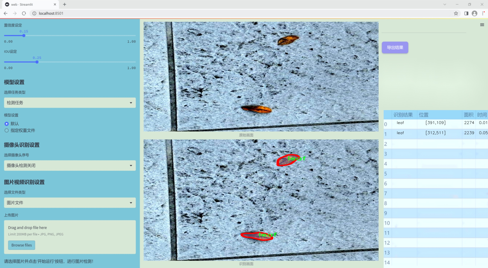
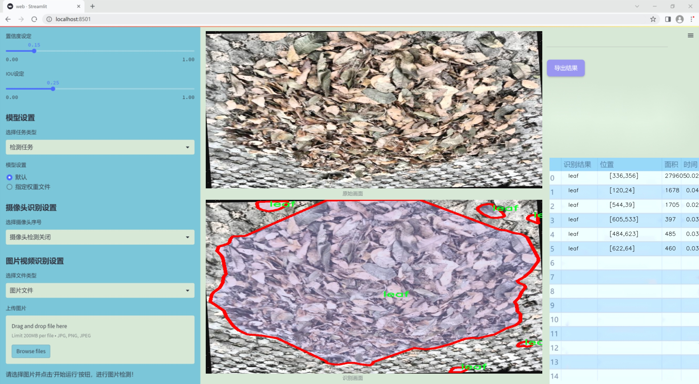
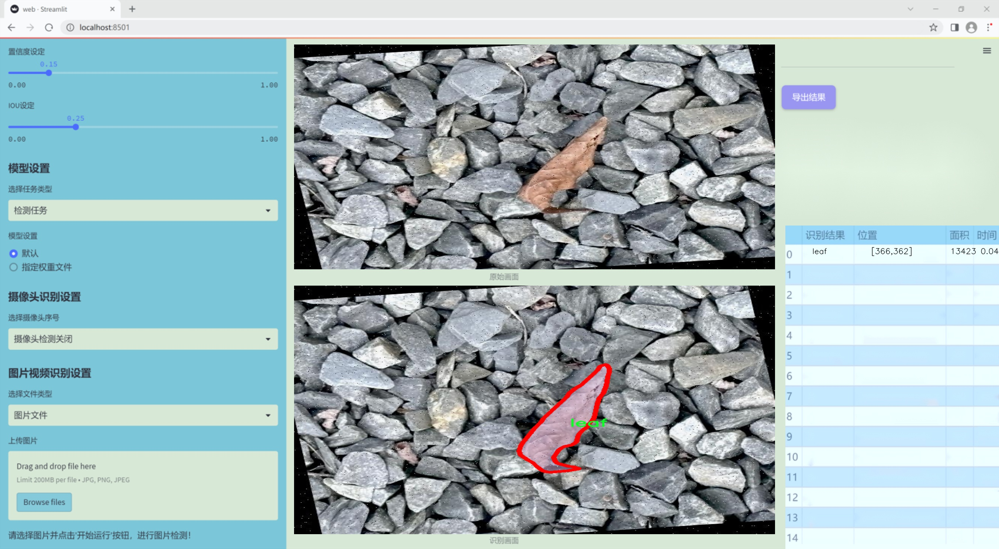
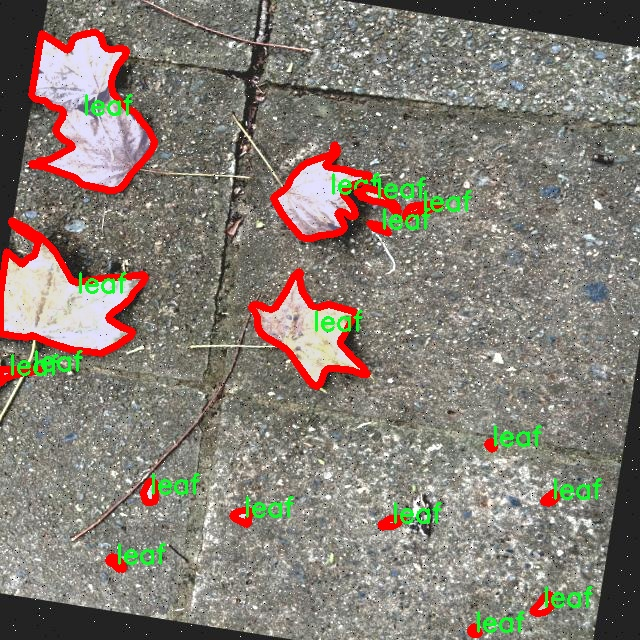
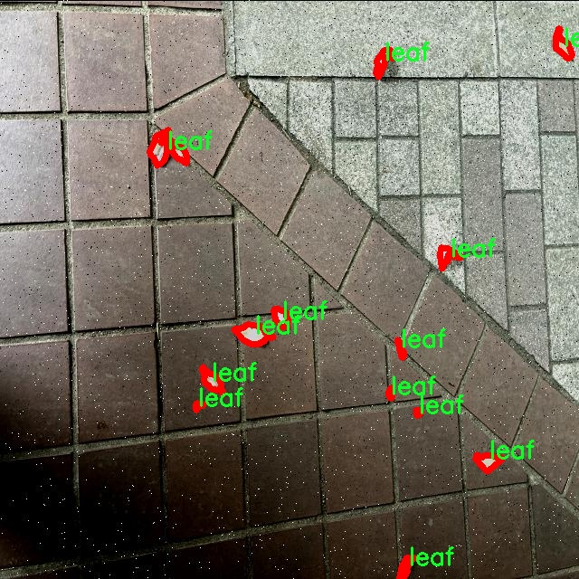
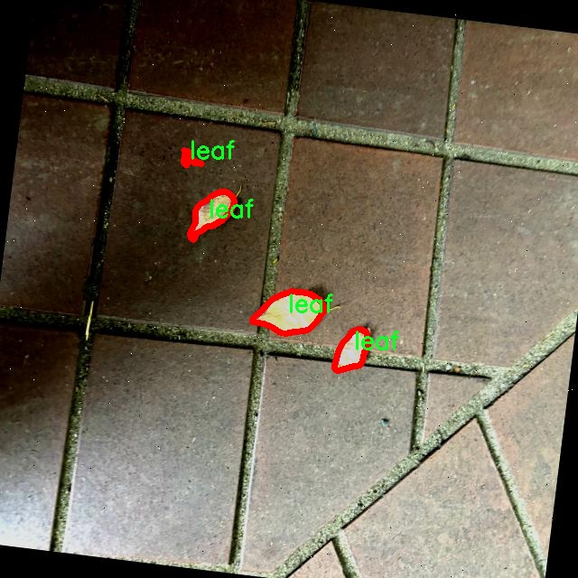
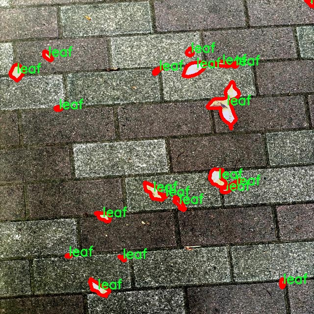
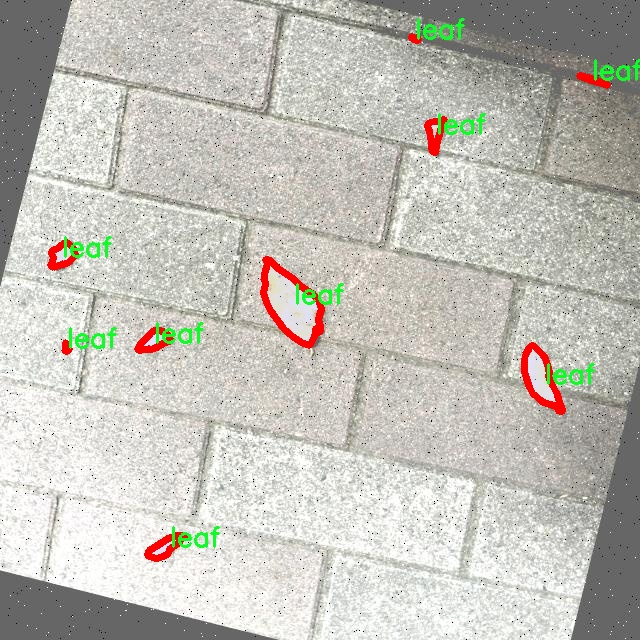

### 1.背景意义

研究背景与意义

随着城市化进程的加快，城市道路的维护与管理面临着越来越多的挑战。尤其是在秋冬季节，落叶不仅影响道路的美观，还可能导致交通事故和行车安全隐患。因此，开发一种高效的路面落叶检测系统显得尤为重要。传统的人工检测方法不仅耗时耗力，而且容易受到天气、光照等因素的影响，准确性和效率难以保证。基于此，利用计算机视觉技术，尤其是深度学习算法，来实现自动化的落叶检测，成为了一个亟待解决的问题。

YOLO（You Only Look Once）系列算法因其高效的实时检测能力而受到广泛关注。YOLOv11作为该系列的最新版本，具备更强的特征提取能力和更快的推理速度，能够在复杂环境中实现高精度的目标检测。通过对YOLOv11的改进，可以更好地适应路面落叶的检测需求。我们的研究将专注于利用改进的YOLOv11模型，构建一个专门针对路面落叶的检测系统。

本研究所使用的数据集包含408张经过精心标注的落叶图像，且数据集的预处理和增强策略为模型的训练提供了良好的基础。通过对图像进行多种形式的增强，如随机旋转、亮度调整和噪声添加等，能够有效提高模型的鲁棒性和泛化能力。这一系统的成功实现，不仅可以提高路面落叶的检测效率，还能为城市管理者提供实时的数据支持，帮助其更好地进行道路维护和安全管理。

综上所述，基于改进YOLOv11的路面落叶检测系统的研究，不仅具有重要的理论意义，还有助于推动智能交通系统的发展，提升城市环境的管理水平。通过本项目的实施，期望能够为未来的智能城市建设提供有力的技术支持。

### 2.视频效果

[2.1 视频效果](https://www.bilibili.com/video/BV1ocBiYaEsz/)

### 3.图片效果







##### [项目涉及的源码数据来源链接](https://kdocs.cn/l/cszuIiCKVNis)**

注意：本项目提供训练的数据集和训练教程,由于版本持续更新,暂不提供权重文件（best.pt）,请按照6.训练教程进行训练后实现上图演示的效果。

### 4.数据集信息

##### 4.1 本项目数据集类别数＆类别名

nc: 1
names: ['leaf']


该项目为【图像分割】数据集，请在【训练教程和Web端加载模型教程（第三步）】这一步的时候按照【图像分割】部分的教程来训练

##### 4.2 本项目数据集信息介绍

本项目数据集信息介绍

本项目旨在改进YOLOv11的路面落叶检测系统，因此构建了一个专门针对“Fallen_leaf”主题的数据集。该数据集的设计考虑了落叶在不同环境和条件下的多样性，以确保模型能够在实际应用中具备良好的鲁棒性和准确性。数据集中包含了一个类别，即“leaf”，这意味着所有的标注和样本均围绕这一单一类别展开。尽管类别数量较少，但我们通过多样化的采集场景和拍摄条件，确保了数据集的丰富性和代表性。

在数据收集过程中，我们选择了多种不同的环境，包括城市公园、林间小道和校园等，力求涵盖不同种类的落叶和背景。这些场景的选择不仅考虑了视觉上的多样性，还注重了光照、天气变化及地面材质等因素对落叶检测的影响。数据集中包含的图像经过精心标注，确保每一片落叶都被准确地框定，以便于后续的模型训练和评估。

此外，为了增强模型的泛化能力，我们还对数据集进行了多种数据增强处理，包括旋转、缩放、翻转和颜色调整等。这些处理旨在模拟真实世界中可能遇到的各种情况，使得模型在面对不同的输入时能够保持高效的检测性能。通过这种方式，我们期望最终构建的路面落叶检测系统能够在多种环境下稳定运行，帮助实现更智能的城市管理和环境监测。











### 5.全套项目环境部署视频教程（零基础手把手教学）

[5.1 所需软件PyCharm和Anaconda安装教程（第一步）](https://www.bilibili.com/video/BV1BoC1YCEKi/?spm_id_from=333.999.0.0&vd_source=bc9aec86d164b67a7004b996143742dc)


[5.2 安装Python虚拟环境创建和依赖库安装视频教程（第二步）](https://www.bilibili.com/video/BV1ZoC1YCEBw?spm_id_from=333.788.videopod.sections&vd_source=bc9aec86d164b67a7004b996143742dc)

### 6.改进YOLOv11训练教程和Web_UI前端加载模型教程（零基础手把手教学）

[6.1 改进YOLOv11训练教程和Web_UI前端加载模型教程（第三步）](https://www.bilibili.com/video/BV1BoC1YCEhR?spm_id_from=333.788.videopod.sections&vd_source=bc9aec86d164b67a7004b996143742dc)


按照上面的训练视频教程链接加载项目提供的数据集，运行train.py即可开始训练



     Epoch   gpu_mem       box       obj       cls    labels  img_size
     1/200     20.8G   0.01576   0.01955  0.007536        22      1280: 100%|██████████| 849/849 [14:42<00:00,  1.04s/it]
               Class     Images     Labels          P          R     mAP@.5 mAP@.5:.95: 100%|██████████| 213/213 [01:14<00:00,  2.87it/s]
                 all       3395      17314      0.994      0.957      0.0957      0.0843

     Epoch   gpu_mem       box       obj       cls    labels  img_size
     2/200     20.8G   0.01578   0.01923  0.007006        22      1280: 100%|██████████| 849/849 [14:44<00:00,  1.04s/it]
               Class     Images     Labels          P          R     mAP@.5 mAP@.5:.95: 100%|██████████| 213/213 [01:12<00:00,  2.95it/s]
                 all       3395      17314      0.996      0.956      0.0957      0.0845

     Epoch   gpu_mem       box       obj       cls    labels  img_size
     3/200     20.8G   0.01561    0.0191  0.006895        27      1280: 100%|██████████| 849/849 [10:56<00:00,  1.29it/s]
               Class     Images     Labels          P          R     mAP@.5 mAP@.5:.95: 100%|███████   | 187/213 [00:52<00:00,  4.04it/s]
                 all       3395      17314      0.996      0.957      0.0957      0.0845


###### [项目数据集下载链接](https://kdocs.cn/l/cszuIiCKVNis)

### 7.原始YOLOv11算法讲解

##### YOLO11简介

> YOLO11源码地址：https://github.com/ultralytics/ultralytics

Ultralytics
YOLO11是一款尖端的、最先进的模型，它在之前YOLO版本成功的基础上进行了构建，并引入了新功能和改进，以进一步提升性能和灵活性。YOLO11设计快速、准确且易于使用，使其成为各种物体检测和跟踪、实例分割、图像分类以及姿态估计任务的绝佳选择。  


**YOLO11创新点如下:**

YOLO 11主要改进包括：  
`增强的特征提取`：YOLO 11采用了改进的骨干和颈部架构，增强了特征提取功能，以实现更精确的目标检测。  
`优化的效率和速度`：优化的架构设计和优化的训练管道提供更快的处理速度，同时保持准确性和性能之间的平衡。  
`更高的精度，更少的参数`：YOLO11m在COCO数据集上实现了更高的平均精度（mAP），参数比YOLOv8m少22%，使其在不影响精度的情况下提高了计算效率。  
`跨环境的适应性`：YOLO 11可以部署在各种环境中，包括边缘设备、云平台和支持NVIDIA GPU的系统。  
`广泛的支持任务`：YOLO 11支持各种计算机视觉任务，如对象检测、实例分割、图像分类、姿态估计和面向对象检测（OBB）。

**YOLO11不同模型尺寸信息：**

YOLO11 提供5种不同的型号规模模型，以满足不同的应用需求：

Model| size (pixels)| mAPval 50-95| Speed CPU ONNX (ms)| Speed T4 TensorRT10
(ms)| params (M)| FLOPs (B)  
---|---|---|---|---|---|---  
YOLO11n| 640| 39.5| 56.1 ± 0.8| 1.5 ± 0.0| 2.6| 6.5  
YOLO11s| 640| 47.0| 90.0 ± 1.2| 2.5 ± 0.0| 9.4| 21.5  
YOLO11m| 640| 51.5| 183.2 ± 2.0| 4.7 ± 0.1| 20.1| 68.0  
YOLO11l| 640| 53.4| 238.6 ± 1.4| 6.2 ± 0.1| 25.3| 86.9  
YOLO11x| 640| 54.7| 462.8 ± 6.7| 11.3 ± 0.2| 56.9| 194.9  
  
**模型常用训练超参数参数说明：**  
`YOLOv11
模型的训练设置包括训练过程中使用的各种超参数和配置`。这些设置会影响模型的性能、速度和准确性。关键的训练设置包括批量大小、学习率、动量和权重衰减。此外，优化器、损失函数和训练数据集组成的选择也会影响训练过程。对这些设置进行仔细的调整和实验对于优化性能至关重要。  
**以下是一些常用的模型训练参数和说明：**

参数名| 默认值| 说明  
---|---|---  
`model`| `None`| 指定用于训练的模型文件。接受指向 `.pt` 预训练模型或 `.yaml`
配置文件。对于定义模型结构或初始化权重至关重要。  
`data`| `None`| 数据集配置文件的路径（例如
`coco8.yaml`).该文件包含特定于数据集的参数，包括训练数据和验证数据的路径、类名和类数。  
`epochs`| `100`| 训练总轮数。每个epoch代表对整个数据集进行一次完整的训练。调整该值会影响训练时间和模型性能。  
`patience`| `100`| 在验证指标没有改善的情况下，提前停止训练所需的epoch数。当性能趋于平稳时停止训练，有助于防止过度拟合。  
`batch`| `16`| 批量大小，有三种模式:设置为整数(例如，’ Batch =16 ‘)， 60% GPU内存利用率的自动模式(’ Batch
=-1 ‘)，或指定利用率分数的自动模式(’ Batch =0.70 ')。  
`imgsz`| `640`| 用于训练的目标图像尺寸。所有图像在输入模型前都会被调整到这一尺寸。影响模型精度和计算复杂度。  
`device`| `None`| 指定用于训练的计算设备：单个 GPU (`device=0`）、多个 GPU (`device=0,1`)、CPU
(`device=cpu`)，或苹果芯片的 MPS (`device=mps`).  
`workers`| `8`| 加载数据的工作线程数（每 `RANK` 多 GPU 训练）。影响数据预处理和输入模型的速度，尤其适用于多 GPU 设置。  
`name`| `None`| 训练运行的名称。用于在项目文件夹内创建一个子目录，用于存储训练日志和输出结果。  
`pretrained`| `True`| 决定是否从预处理模型开始训练。可以是布尔值，也可以是加载权重的特定模型的字符串路径。提高训练效率和模型性能。  
`optimizer`| `'auto'`| 为训练模型选择优化器。选项包括 `SGD`, `Adam`, `AdamW`, `NAdam`,
`RAdam`, `RMSProp` 等，或 `auto` 用于根据模型配置进行自动选择。影响收敛速度和稳定性  
`lr0`| `0.01`| 初始学习率（即 `SGD=1E-2`, `Adam=1E-3`) .调整这个值对优化过程至关重要，会影响模型权重的更新速度。  
`lrf`| `0.01`| 最终学习率占初始学习率的百分比 = (`lr0 * lrf`)，与调度程序结合使用，随着时间的推移调整学习率。  


**各损失函数作用说明：**  
`定位损失box_loss`：预测框与标定框之间的误差（GIoU），越小定位得越准；  
`分类损失cls_loss`：计算锚框与对应的标定分类是否正确，越小分类得越准；  
`动态特征损失（dfl_loss）`：DFLLoss是一种用于回归预测框与目标框之间距离的损失函数。在计算损失时，目标框需要缩放到特征图尺度，即除以相应的stride，并与预测的边界框计算Ciou
Loss，同时与预测的anchors中心点到各边的距离计算回归DFLLoss。  


### 8.200+种全套改进YOLOV11创新点原理讲解

#### 8.1 200+种全套改进YOLOV11创新点原理讲解大全

由于篇幅限制，每个创新点的具体原理讲解就不全部展开，具体见下列网址中的改进模块对应项目的技术原理博客网址【Blog】（创新点均为模块化搭建，原理适配YOLOv5~YOLOv11等各种版本）

[改进模块技术原理博客【Blog】网址链接](https://gitee.com/qunmasj/good)


#### 8.2 精选部分改进YOLOV11创新点原理讲解

###### 这里节选部分改进创新点展开原理讲解(完整的改进原理见上图和[改进模块技术原理博客链接](https://gitee.com/qunmasj/good)【如果此小节的图加载失败可以通过CSDN或者Github搜索该博客的标题访问原始博客，原始博客图片显示正常】

### 动态蛇形卷积Dynamic Snake Convolution

参考论文： 2307.08388.pdf (arxiv.org)

血管、道路等拓扑管状结构的精确分割在各个领域都至关重要，确保下游任务的准确性和效率。 然而，许多因素使任务变得复杂，包括薄的局部结构和可变的全局形态。在这项工作中，我们注意到管状结构的特殊性，并利用这些知识来指导我们的 DSCNet 在三个阶段同时增强感知：特征提取、特征融合、 和损失约束。 首先，我们提出了一种动态蛇卷积，通过自适应地关注细长和曲折的局部结构来准确捕获管状结构的特征。 随后，我们提出了一种多视图特征融合策略，以补充特征融合过程中多角度对特征的关注，确保保留来自不同全局形态的重要信息。 最后，提出了一种基于持久同源性的连续性约束损失函数，以更好地约束分割的拓扑连续性。 2D 和 3D 数据集上的实验表明，与多种方法相比，我们的 DSCNet 在管状结构分割任务上提供了更好的准确性和连续性。 我们的代码是公开的。 
主要的挑战源于细长微弱的局部结构特征与复杂多变的全局形态特征。本文关注到管状结构细长连续的特点，并利用这一信息在神经网络以下三个阶段同时增强感知：特征提取、特征融合和损失约束。分别设计了动态蛇形卷积（Dynamic Snake Convolution），多视角特征融合策略与连续性拓扑约束损失。 

我们希望卷积核一方面能够自由地贴合结构学习特征，另一方面能够在约束条件下不偏离目标结构太远。在观察管状结构的细长连续的特征后，脑海里想到了一个动物——蛇。我们希望卷积核能够像蛇一样动态地扭动，来贴合目标的结构。

我们希望卷积核一方面能够自由地贴合结构学习特征，另一方面能够在约束条件下不偏离目标结构太远。在观察管状结构的细长连续的特征后，脑海里想到了一个动物——蛇。我们希望卷积核能够像蛇一样动态地扭动，来贴合目标的结构。


### DCNV2融入YOLOv11
DCN和DCNv2（可变性卷积）
网上关于两篇文章的详细描述已经很多了，我这里具体的细节就不多讲了，只说一下其中实现起来比较困惑的点。（黑体字会讲解）

DCNv1解决的问题就是我们常规的图像增强，仿射变换（线性变换加平移）不能解决的多种形式目标变换的几何变换的问题。如下图所示。

可变性卷积的思想很简单，就是讲原来固定形状的卷积核变成可变的。如下图所示：


首先来看普通卷积，以3x3卷积为例对于每个输出y(p0)，都要从x上采样9个位置，这9个位置都在中心位置x(p0)向四周扩散得到的gird形状上，(-1,-1)代表x(p0)的左上角，(1,1)代表x(p0)的右下角，其他类似。

用公式表示如下：


可变性卷积Deformable Conv操作并没有改变卷积的计算操作，而是在卷积操作的作用区域上，加入了一个可学习的参数∆pn。同样对于每个输出y(p0)，都要从x上采样9个位置，这9个位置是中心位置x(p0)向四周扩散得到的，但是多了 ∆pn，允许采样点扩散成非gird形状。


偏移量是通过对原始特征层进行卷积得到的。比如输入特征层是w×h×c，先对输入的特征层进行卷积操作，得到w×h×2c的offset field。这里的w和h和原始特征层的w和h是一致的，offset field里面的值是输入特征层对应位置的偏移量，偏移量有x和y两个方向，所以offset field的channel数是2c。offset field里的偏移量是卷积得到的，可能是浮点数，所以接下来需要通过双向性插值计算偏移位置的特征值。在偏移量的学习中，梯度是通过双线性插值来进行反向传播的。
看到这里是不是还是有点迷茫呢？那到底程序上面怎么实现呢？


事实上由上面的公式我们可以看得出来∆pn这个偏移量是加在原像素点上的，但是我们怎么样从代码上对原像素点加这个量呢？其实很简单，就是用一个普通的卷积核去跟输入图片（一般是输入的feature_map）卷积就可以了卷积核的数量是2N也就是23*3==18（前9个通道是x方向的偏移量，后9个是y方向的偏移量），然后把这个卷积的结果与正常卷积的结果进行相加就可以了。
然后又有了第二个问题，怎么样反向传播呢？为什么会有这个问题呢？因为求出来的偏移量+正常卷积输出的结果往往是一个浮点数，浮点数是无法对应到原图的像素点的，所以自然就想到了双线性差值的方法求出浮点数对应的浮点像素点。


#### DCN v2
对于positive的样本来说，采样的特征应该focus在RoI内，如果特征中包含了过多超出RoI的内容，那么结果会受到影响和干扰。而negative样本则恰恰相反，引入一些超出RoI的特征有助于帮助网络判别这个区域是背景区域。

DCNv1引入了可变形卷积，能更好的适应目标的几何变换。但是v1可视化结果显示其感受野对应位置超出了目标范围，导致特征不受图像内容影响（理想情况是所有的对应位置分布在目标范围以内）。

为了解决该问题：提出v2, 主要有

1、扩展可变形卷积，增强建模能力
2、提出了特征模拟方案指导网络培训：feature mimicking scheme

上面这段话是什么意思呢，通俗来讲就是，我们的可变性卷积的区域大于目标所在区域，所以这时候就会对非目标区域进行错误识别。

所以自然能想到的解决方案就是加入权重项进行惩罚。（至于这个实现起来就比较简单了，直接初始化一个权重然后乘(input+offsets)就可以了）


可调节的RoIpooling也是类似的，公式如下：


### 9.系统功能展示

图9.1.系统支持检测结果表格显示

  图9.2.系统支持置信度和IOU阈值手动调节

  图9.3.系统支持自定义加载权重文件best.pt(需要你通过步骤5中训练获得)

  图9.4.系统支持摄像头实时识别

  图9.5.系统支持图片识别

  图9.6.系统支持视频识别

  图9.7.系统支持识别结果文件自动保存

  图9.8.系统支持Excel导出检测结果数据


### 10. YOLOv11核心改进源码讲解

#### 10.1 transformer.py

以下是对代码的逐文件分析和核心部分的保留，并附上详细的中文注释：

```python
import torch
import torch.nn as nn
from functools import partial

from .prepbn import RepBN, LinearNorm
from ..modules.transformer import TransformerEncoderLayer

# 定义可导出的模块
__all__ = ['AIFI_RepBN']

# 使用 LayerNorm 和 RepBN 作为线性归一化的部分
ln = nn.LayerNorm
linearnorm = partial(LinearNorm, norm1=ln, norm2=RepBN, step=60000)

class TransformerEncoderLayer_RepBN(TransformerEncoderLayer):
    def __init__(self, c1, cm=2048, num_heads=8, dropout=0, act=..., normalize_before=False):
        # 初始化父类 TransformerEncoderLayer
        super().__init__(c1, cm, num_heads, dropout, act, normalize_before)
        
        # 使用线性归一化
        self.norm1 = linearnorm(c1)
        self.norm2 = linearnorm(c1)

class AIFI_RepBN(TransformerEncoderLayer_RepBN):
    """定义 AIFI transformer 层。"""

    def __init__(self, c1, cm=2048, num_heads=8, dropout=0, act=nn.GELU(), normalize_before=False):
        """使用指定参数初始化 AIFI 实例。"""
        super().__init__(c1, cm, num_heads, dropout, act, normalize_before)

    def forward(self, x):
        """AIFI transformer 层的前向传播。"""
        c, h, w = x.shape[1:]  # 获取输入的通道数、高度和宽度
        pos_embed = self.build_2d_sincos_position_embedding(w, h, c)  # 构建位置嵌入
        # 将输入张量从形状 [B, C, H, W] 展平为 [B, HxW, C]
        x = super().forward(x.flatten(2).permute(0, 2, 1), pos=pos_embed.to(device=x.device, dtype=x.dtype))
        # 将输出张量的形状从 [B, HxW, C] 转换回 [B, C, H, W]
        return x.permute(0, 2, 1).view([-1, c, h, w]).contiguous()

    @staticmethod
    def build_2d_sincos_position_embedding(w, h, embed_dim=256, temperature=10000.0):
        """构建 2D 正弦-余弦位置嵌入。"""
        assert embed_dim % 4 == 0, "嵌入维度必须是 4 的倍数，以便进行 2D 正弦-余弦位置嵌入"
        grid_w = torch.arange(w, dtype=torch.float32)  # 创建宽度的网格
        grid_h = torch.arange(h, dtype=torch.float32)  # 创建高度的网格
        grid_w, grid_h = torch.meshgrid(grid_w, grid_h, indexing="ij")  # 生成网格坐标
        pos_dim = embed_dim // 4  # 计算位置维度
        omega = torch.arange(pos_dim, dtype=torch.float32) / pos_dim  # 计算频率
        omega = 1.0 / (temperature**omega)  # 根据温度调整频率

        # 计算宽度和高度的正弦和余弦值
        out_w = grid_w.flatten()[..., None] @ omega[None]
        out_h = grid_h.flatten()[..., None] @ omega[None]

        # 返回拼接的正弦和余弦位置嵌入
        return torch.cat([torch.sin(out_w), torch.cos(out_w), torch.sin(out_h), torch.cos(out_h)], 1)[None]
```

### 代码核心部分说明：
1. **TransformerEncoderLayer_RepBN**: 这个类继承自 `TransformerEncoderLayer`，并在初始化时定义了两个归一化层 `norm1` 和 `norm2`，使用了自定义的线性归一化方法。

2. **AIFI_RepBN**: 这个类是主要的 transformer 层，包含了前向传播的方法。它通过调用父类的 `forward` 方法来处理输入，并构建了 2D 正弦-余弦位置嵌入。

3. **build_2d_sincos_position_embedding**: 这是一个静态方法，用于生成 2D 的正弦和余弦位置嵌入，确保嵌入维度是 4 的倍数，并使用温度参数调整频率。

通过这些核心部分的实现，AIFI transformer 层能够有效地处理输入数据并利用位置嵌入来增强模型的表现。

这个程序文件定义了一个基于Transformer架构的模型，主要是实现了一个名为AIFI_RepBN的Transformer编码层。首先，文件导入了必要的PyTorch库和一些自定义模块。RepBN和LinearNorm是用于归一化的模块，而TransformerEncoderLayer和AIFI则是Transformer架构的基础组件。

在类的定义中，TransformerEncoderLayer_RepBN继承自TransformerEncoderLayer，构造函数中调用了父类的构造函数，并初始化了两个归一化层norm1和norm2，使用了一个名为linearnorm的部分应用函数，该函数结合了LayerNorm和RepBN，且设定了一个步数参数60000。

接下来，AIFI_RepBN类继承自TransformerEncoderLayer_RepBN，定义了AIFI Transformer层。在其构造函数中，除了调用父类的构造函数外，还允许用户指定一些参数，比如输入通道数、隐藏层大小、注意力头数、丢弃率、激活函数和是否在归一化之前进行处理。

在前向传播方法forward中，首先获取输入张量x的形状信息，包括通道数c、高度h和宽度w。接着，调用build_2d_sincos_position_embedding方法生成2D的正弦余弦位置嵌入，这个嵌入是Transformer模型中用于捕捉位置信息的重要部分。然后，输入张量x被展平并进行维度变换，以适应Transformer的输入格式，最后通过父类的forward方法进行计算，返回的结果再进行维度变换，恢复成原来的形状。

build_2d_sincos_position_embedding方法用于构建2D正弦余弦位置嵌入。它首先检查嵌入维度是否可以被4整除，这是因为2D位置嵌入的计算需要这个条件。接着，它创建了宽度和高度的网格，并计算出对应的正弦和余弦值，最终将这些值拼接在一起，形成一个位置嵌入的张量。

总的来说，这个文件实现了一个结合了归一化技术和位置嵌入的Transformer编码层，适用于处理图像等二维数据。

#### 10.2 metaformer.py

以下是代码中最核心的部分，并附上详细的中文注释：

```python
import torch
import torch.nn as nn
import torch.nn.functional as F

class MF_Attention(nn.Module):
    """
    自注意力机制的实现，来源于Transformer。
    """
    def __init__(self, dim, head_dim=32, num_heads=None, qkv_bias=False,
                 attn_drop=0., proj_drop=0., proj_bias=False):
        super().__init__()

        # 设置每个头的维度和缩放因子
        self.head_dim = head_dim
        self.scale = head_dim ** -0.5

        # 计算头的数量
        self.num_heads = num_heads if num_heads else dim // head_dim
        if self.num_heads == 0:
            self.num_heads = 1
        
        # 计算注意力的总维度
        self.attention_dim = self.num_heads * self.head_dim

        # 定义Q、K、V的线性变换
        self.qkv = nn.Linear(dim, self.attention_dim * 3, bias=qkv_bias)
        self.attn_drop = nn.Dropout(attn_drop)  # 注意力的dropout
        self.proj = nn.Linear(self.attention_dim, dim, bias=proj_bias)  # 输出的线性变换
        self.proj_drop = nn.Dropout(proj_drop)  # 输出的dropout

    def forward(self, x):
        B, H, W, C = x.shape  # 获取输入的批次大小、高度、宽度和通道数
        N = H * W  # 计算总的像素数
        # 计算Q、K、V
        qkv = self.qkv(x).reshape(B, N, 3, self.num_heads, self.head_dim).permute(2, 0, 3, 1, 4)
        q, k, v = qkv.unbind(0)  # 分离Q、K、V

        # 计算注意力权重
        attn = (q @ k.transpose(-2, -1)) * self.scale  # 计算点积注意力
        attn = attn.softmax(dim=-1)  # 归一化
        attn = self.attn_drop(attn)  # 应用dropout

        # 计算输出
        x = (attn @ v).transpose(1, 2).reshape(B, H, W, self.attention_dim)  # 应用注意力权重
        x = self.proj(x)  # 线性变换
        x = self.proj_drop(x)  # 应用dropout
        return x  # 返回输出

class MetaFormerBlock(nn.Module):
    """
    MetaFormer块的实现，包含自注意力和MLP。
    """
    def __init__(self, dim,
                 token_mixer=nn.Identity, mlp=Mlp,
                 norm_layer=partial(LayerNormWithoutBias, eps=1e-6),
                 drop=0., drop_path=0.,
                 layer_scale_init_value=None, res_scale_init_value=None):
        super().__init__()

        # 归一化层
        self.norm1 = norm_layer(dim)
        # 令牌混合器
        self.token_mixer = token_mixer(dim=dim, drop=drop)
        # 路径丢弃
        self.drop_path1 = DropPath(drop_path) if drop_path > 0. else nn.Identity()
        # 层缩放
        self.layer_scale1 = Scale(dim=dim, init_value=layer_scale_init_value) if layer_scale_init_value else nn.Identity()
        self.res_scale1 = Scale(dim=dim, init_value=res_scale_init_value) if res_scale_init_value else nn.Identity()

        # 第二个归一化层和MLP
        self.norm2 = norm_layer(dim)
        self.mlp = mlp(dim=dim, drop=drop)
        self.drop_path2 = DropPath(drop_path) if drop_path > 0. else nn.Identity()
        self.layer_scale2 = Scale(dim=dim, init_value=layer_scale_init_value) if layer_scale_init_value else nn.Identity()
        self.res_scale2 = Scale(dim=dim, init_value=res_scale_init_value) if res_scale_init_value else nn.Identity()
        
    def forward(self, x):
        # 输入数据的维度转换
        x = x.permute(0, 2, 3, 1)
        # 第一部分：归一化 -> 混合 -> 路径丢弃 -> 层缩放
        x = self.res_scale1(x) + \
            self.layer_scale1(
                self.drop_path1(
                    self.token_mixer(self.norm1(x))
                )
            )
        # 第二部分：归一化 -> MLP -> 路径丢弃 -> 层缩放
        x = self.res_scale2(x) + \
            self.layer_scale2(
                self.drop_path2(
                    self.mlp(self.norm2(x))
                )
            )
        return x.permute(0, 3, 1, 2)  # 返回输出并转换维度
```

### 代码核心部分解释：
1. **MF_Attention** 类实现了自注意力机制，主要通过计算输入的Q、K、V来获得注意力权重，并将其应用于值（V）上，最终输出经过线性变换和dropout的结果。
2. **MetaFormerBlock** 类实现了一个MetaFormer块，包含了自注意力和多层感知机（MLP）。它通过归一化、混合、路径丢弃和层缩放来处理输入数据，并在两个阶段中分别应用自注意力和MLP。

这个程序文件`metaformer.py`实现了一种名为MetaFormer的深度学习模型的多个组件，主要用于图像处理和计算机视觉任务。文件中使用了PyTorch库，定义了多个神经网络模块，以下是对这些模块的逐一说明。

首先，文件引入了一些必要的库，包括`torch`和`torch.nn`，以及一些函数和类，如`partial`、`DropPath`和`to_2tuple`。接着，定义了一些常用的模块，如`Scale`、`SquaredReLU`和`StarReLU`。`Scale`类用于对输入进行元素级别的缩放，`SquaredReLU`和`StarReLU`则是不同形式的激活函数，前者是对ReLU激活后的结果进行平方，后者则在ReLU的基础上加入了可学习的缩放和偏置。

接下来是`MF_Attention`类，它实现了标准的自注意力机制，通常用于Transformer模型中。该类通过线性变换生成查询、键和值，并计算注意力权重。注意力权重经过softmax处理后与值相乘，最终通过线性变换和dropout层输出结果。

`RandomMixing`类则实现了一种随机混合机制，通过一个随机矩阵对输入进行线性变换，增强模型的表达能力。

`LayerNormGeneral`类是一个通用的层归一化实现，支持不同的输入形状和归一化维度，允许用户选择是否使用缩放和偏置。`LayerNormWithoutBias`是一个优化版本，直接使用PyTorch的`F.layer_norm`函数，速度更快。

`SepConv`类实现了分离卷积，结合了逐点卷积和深度卷积的优点，通常用于减少参数量和计算量。`Pooling`类实现了一种特定的池化操作，返回输入与池化结果的差异。

`Mlp`类实现了多层感知机（MLP），包括两个线性层和激活函数，通常用于特征转换。`ConvolutionalGLU`类实现了一种卷积门控线性单元（GLU），结合了卷积和门控机制。

`MetaFormerBlock`和`MetaFormerCGLUBlock`类实现了MetaFormer的基本构建块。前者使用标准的MLP作为混合器，后者则使用卷积GLU。两个类都包含层归一化、残差连接和drop path机制，以增强模型的训练稳定性和性能。

总体来说，这个文件定义了一系列模块，旨在构建灵活且高效的MetaFormer模型，适用于各种计算机视觉任务。每个模块都经过精心设计，以便在不同的网络架构中进行组合和使用。

#### 10.3 pkinet.py

以下是经过简化和注释的核心代码部分：

```python
import math
import torch
import torch.nn as nn

# 定义DropPath类，用于随机丢弃路径（随机深度），通常用于残差块的主路径中
class DropPath(nn.Module):
    """Drop paths (Stochastic Depth) per sample."""
    def __init__(self, drop_prob: float = 0.1):
        super().__init__()
        self.drop_prob = drop_prob  # 丢弃概率

    def forward(self, x: torch.Tensor) -> torch.Tensor:
        # 如果丢弃概率为0或不在训练模式下，直接返回输入
        if self.drop_prob == 0. or not self.training:
            return x
        keep_prob = 1 - self.drop_prob
        shape = (x.shape[0], ) + (1, ) * (x.ndim - 1)  # 处理不同维度的张量
        random_tensor = keep_prob + torch.rand(shape, dtype=x.dtype, device=x.device)
        output = x.div(keep_prob) * random_tensor.floor()  # 应用丢弃
        return output

# 定义一个简单的卷积模块
class ConvModule(nn.Module):
    def __init__(self, in_channels, out_channels, kernel_size, stride=1, padding=0, norm_cfg=None, act_cfg=None):
        super().__init__()
        layers = []
        layers.append(nn.Conv2d(in_channels, out_channels, kernel_size, stride, padding))
        if norm_cfg:
            layers.append(nn.BatchNorm2d(out_channels))
        if act_cfg:
            layers.append(getattr(nn, act_cfg['type'])())
        self.conv = nn.Sequential(*layers)

    def forward(self, x):
        return self.conv(x)

# 定义Poly Kernel Inception Block
class PKIBlock(nn.Module):
    """Poly Kernel Inception Block"""
    def __init__(self, in_channels: int, out_channels: int):
        super().__init__()
        self.pre_conv = ConvModule(in_channels, out_channels, kernel_size=1)  # 预卷积
        self.dw_conv = ConvModule(out_channels, out_channels, kernel_size=3, stride=1, padding=1)  # 深度卷积
        self.pw_conv = ConvModule(out_channels, out_channels, kernel_size=1)  # 点卷积

    def forward(self, x):
        x = self.pre_conv(x)  # 先进行预卷积
        x = self.dw_conv(x)   # 深度卷积
        x = self.pw_conv(x)   # 点卷积
        return x

# 定义Poly Kernel Inception Network
class PKINet(nn.Module):
    """Poly Kernel Inception Network"""
    def __init__(self):
        super().__init__()
        self.stem = ConvModule(3, 32, kernel_size=3, stride=2, padding=1)  # Stem层
        self.block = PKIBlock(32, 64)  # 添加一个PKIBlock

    def forward(self, x):
        x = self.stem(x)  # 通过Stem层
        x = self.block(x)  # 通过PKIBlock
        return x

# 创建模型实例
def PKINET_T():
    return PKINet()

# 主程序入口
if __name__ == '__main__':
    model = PKINET_T()  # 实例化模型
    inputs = torch.randn((1, 3, 640, 640))  # 创建输入张量
    res = model(inputs)  # 前向传播
    print(res.size())  # 输出结果的尺寸
```

### 代码注释说明：
1. **DropPath类**：实现了随机丢弃路径的功能，通常用于深度学习模型中的残差块，以减少过拟合。
2. **ConvModule类**：封装了卷积层、批归一化和激活函数的组合，简化了卷积层的创建过程。
3. **PKIBlock类**：实现了一个多核的Inception模块，包含预卷积、深度卷积和点卷积。
4. **PKINet类**：构建了一个简单的多核Inception网络，包含Stem层和一个PKIBlock。
5. **主程序入口**：实例化模型并进行前向传播，输出结果的尺寸。

这个程序文件 `pkinet.py` 实现了一个名为 PKINet 的深度学习模型，主要用于计算机视觉任务。该模型的结构基于多种卷积模块和注意力机制，旨在提高图像处理的性能。以下是对代码的详细讲解。

首先，文件导入了一些必要的库，包括数学库、类型提示、PyTorch 及其神经网络模块。接着，它尝试导入一些来自 `mmcv` 和 `mmengine` 的模块，如果导入失败，则使用 PyTorch 的基础模块作为替代。

接下来，定义了一些辅助函数和类。`drop_path` 函数实现了随机深度（Stochastic Depth）技术，用于在训练期间随机丢弃某些路径，以提高模型的泛化能力。`DropPath` 类是对这个函数的封装，方便在模型中使用。

`autopad` 函数用于自动计算卷积的填充，以确保输出尺寸与输入尺寸一致。`make_divisible` 函数则用于确保通道数是某个值的倍数，以便于模型的兼容性和性能。

接下来定义了一些用于数据格式转换的类，如 `BCHW2BHWC` 和 `BHWC2BCHW`，它们用于在不同的张量维度之间进行转换。

`GSiLU` 类实现了一种激活函数，即全局 Sigmoid 门控线性单元，能够自适应地调整特征图的激活值。

`CAA` 类实现了上下文锚点注意力机制，旨在增强特征图的表达能力。`ConvFFN` 类则实现了一个多层感知机（MLP），使用卷积模块构建。

`Stem` 和 `DownSamplingLayer` 类分别实现了模型的初始层和下采样层，负责特征图的初步处理和尺寸缩小。

`InceptionBottleneck` 类实现了一个瓶颈结构，结合了多个卷积操作，以提取多尺度特征。`PKIBlock` 类则是一个多核的 Inception 模块，集成了上下文锚点注意力和前馈网络。

`PKIStage` 类将多个 `PKIBlock` 组合在一起，形成模型的一个阶段。最后，`PKINet` 类则是整个网络的主类，负责构建网络的不同阶段，并定义前向传播过程。

在 `PKINet` 的构造函数中，定义了不同的网络架构设置，并根据输入参数构建相应的网络层。模型的权重初始化也在此处进行。

最后，文件提供了三个函数 `PKINET_T`、`PKINET_S` 和 `PKINET_B`，分别用于创建不同规模的 PKINet 模型。在主程序中，创建了一个 PKINET_T 模型实例，并通过随机生成的输入张量进行前向传播，输出每个阶段的特征图尺寸。

总体而言，这个文件实现了一个复杂的深度学习模型，结合了多种先进的技术，旨在提升计算机视觉任务的性能。

### 11.完整训练+Web前端界面+200+种全套创新点源码、数据集获取


# [下载链接：https://mbd.pub/o/bread/Z5iZmZ5w](https://mbd.pub/o/bread/Z5iZmZ5w)